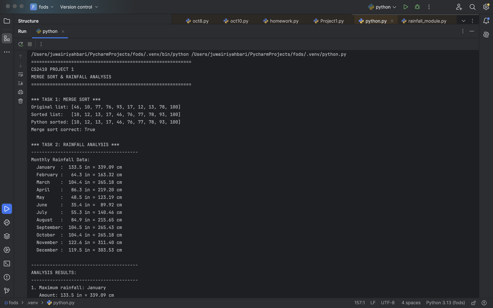
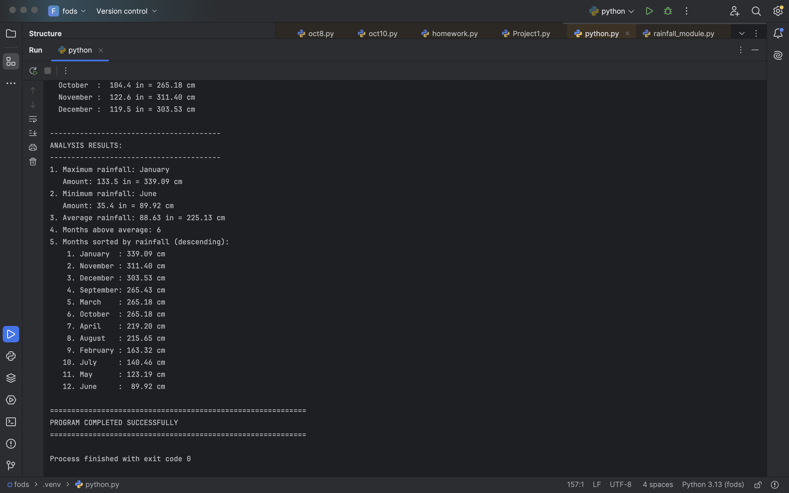

# Python Rainfall Analysis

This project analyzes monthly rainfall data using Python. It demonstrates modular programming, custom sorting functions, list processing, and basic data analysis.

## Project Overview

The program allows the user to work with rainfall data and organize it in different ways. It includes a main program file and a separate module file, showing how Python code can be divided into reusable parts.

## Skills Demonstrated

* Python programming
* Modular code design
* Functions
* Lists and loops
* Custom sorting algorithms
* User input and output
* Basic data analysis

## Files

* `main_program.py` — Runs the main rainfall analysis program
* `rainfall_module.py` — Contains helper functions used by the main program
* `screenshots/` — Contains images of the program output

## Example Output

## Course Context

This project was completed as part of a Fundamentals of Data Science course.
